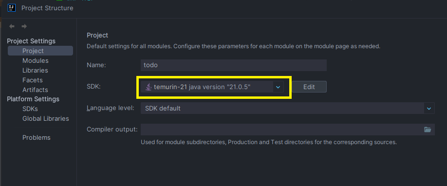
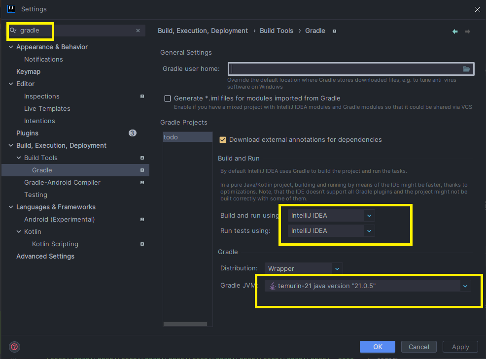
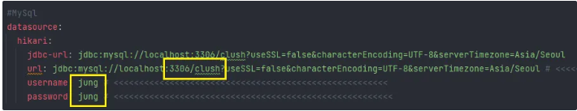
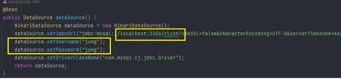

# CLUSH 개발과제(백엔드)

# ✅ 개발 환경
### IDE: `IntelliJ IDEA`
### 프레임워크: `Spring Boot 3.4`
### DB: `MySQL`
### ORM: `MyBatis`
### 빌드 도구: `Gradle`
### 개발언어: `JAVA(JDK-21)`

 

# ✅ 소스 빌드 및 설정 방법
### 1. 프로젝트 클론
> git clone https://github.com/jsms91/ToDo.git

### 2. Java 버전 설정(JDK-21) -> 인텔리 제이
> 2-1. jdk 21버전으로 설정(Shift + ctrl + alt + s)

> 2-2. 추가 설정(alt + ctrl + s)

#### [gradle 검색 후 다음 사진과 같이 설정]

### 3. application.yml 파일 수정
> spring: 
&nbsp;&nbsp; datasource: 
&nbsp;&nbsp;&nbsp;&nbsp;&nbsp; url: jdbc:mysql://localhost:3306/{데이터베이스명} 
&nbsp;&nbsp;&nbsp;&nbsp;&nbsp; username: {MySQL 사용자명} 
&nbsp;&nbsp;&nbsp;&nbsp;&nbsp; password: {MySQL 비밀번호}
> 

### 4. MyBatisConfig.class 수정
>@Configuration  
 public class MyBatisConfig {  
&nbsp;&nbsp;&nbsp;&nbsp; @Bean  
&nbsp;&nbsp;&nbsp;&nbsp; public DataSource dataSource() {  
&nbsp;&nbsp;&nbsp;&nbsp;&nbsp;&nbsp;&nbsp;&nbsp; return DataSourceBuilder.create() 
&nbsp;&nbsp;&nbsp;&nbsp;&nbsp;&nbsp;&nbsp;&nbsp;&nbsp;&nbsp;&nbsp;&nbsp; .url("jdbc:mysql://localhost:3306/{데이터베이스명}") 
&nbsp;&nbsp;&nbsp;&nbsp;&nbsp;&nbsp;&nbsp;&nbsp;&nbsp;&nbsp;&nbsp;&nbsp; .username("{사용자명}")  
&nbsp;&nbsp;&nbsp;&nbsp;&nbsp;&nbsp;&nbsp;&nbsp;&nbsp;&nbsp;&nbsp;&nbsp; .password("{비밀번호}")  
&nbsp;&nbsp;&nbsp;&nbsp;&nbsp;&nbsp;&nbsp;&nbsp;&nbsp;&nbsp;&nbsp;&nbsp; .build(); 
&nbsp;&nbsp;&nbsp;&nbsp; } 
}
> 

### 5. DB 테이블 생성 및 기본 데이터 삽입
> MYSQL 실행하여 앞에서 설정한 계정으로 로그인 -> 데이터베이스 사용(use {database명})  
> -> 테이블을 생성 및 기본 데이터 삽입. 
> (테이블 생성 쿼리 및 기본데이터 삽입 쿼리는 아래 링크 또는 메일 첨부파일)

[DB 쿼리] 
https://gelatinous-paradox-110.notion.site/DB-15c59728205480528a28e965ae44eaf1?pvs=4

### 6. 테스트 설정 수정(4번에 삽입 쿼리 실행 후 변경사항 없으면 수정x)
> TodoApplicationTests에서 4.todoUpdate 테스트의 todoNumber 값을 존재하는 데이터로 수정합니다.

 

# ✅ 작동 확인 방법
> 스웨거 URL을 통해 데이터를 등록, 조회, 수정, 삭제를 할 수 있다.

- URL : http://localhost:8080/todo 또는 http://localhost:8080/swagger-ui/index.html

### 1. todo 등록(todo/todoRegister)
> title, description, targetDate를 입력 후 Execute  
> (todoNumber은 입력x, targetDate 형식은 yyyy-MM-dd으로 작성)

### 2. todo 목록(todo/todoList)
> Execute 하면 전체 목록 조회(일단은 활성화,비활성화 상태 모두 조회)

### 3. 상세 정보(todo/todoInfo/{todoNumber})
> todoNumber 입력 후 Execute

#### 4. todo 수정(todo/todoModify/{todoNumber})
> Parameters의 수정 할 todoNumber 입력 
> title, description, targetDate, status를 입력 후 Execute 
> (todoNumber은 입력x, targetDate 형식은 yyyy-MM-dd으로 작성, status는 true 또는  false)

#### 5. todo 삭제(todo/todoDelete/{todoNumber})
> 삭제할 todoNumber 입력 후 Execute

 

# ✅ 주력으로 사용한 라이브러리
### 1. MyBatis
> MyBatis는 SQL을 직접 작성할 수 있는 유연성과 함께, XML 매핑 및 어노테이션 기반 매핑을 지원하여 복잡한 SQL 작업을 간소화할 수 있는 프레임워크입니다. 이처럼 명시적으로 SQL을 제어할 수 있다는 점에서 MyBatis를 사용하였습니다. 또한, JPA 방식도 있지만 교육과정에서 MyBatis를 사용하여 프로젝트를 진행한 경험이 있었기 때문에, 제한된 기간 내 개발을 위해 익숙한 MyBatis를 선택하였습니다.

### 2. Lombok
> Lombok은 개발 과정에서 반복적으로 작성해야 하는 코드를 줄이는 데 도움을 주는 라이브러리입니다. 예를 들어, Getter나 Setter 메서드, 생성자, toString(), equals()와 같은 메서드를 직접 작성하지 않고도, @Getter, @Setter, @ToString 등 어노테이션을 사용하여 자동으로 생성할 수 있어 코드를 간결하게 만들어 주기 때문에 사용하였습니다.

### 3. SpringDoc (Swagger)
> SpringDoc은 OpenAPI 사양을 기반으로 Swagger UI를 생성하여, API 명세서를 시각적으로 확인하고 API를 직접 테스트할 수 있는 환경을 제공합니다. 특히, 프론트엔드와 백엔드가 별도로 개발되는 환경에서, 백엔드 개발자는 프론트엔드에서 구현한 UI를 통해 API 동작을 확인하기 어렵습니다. 그러나 Swagger를 사용하면 API 명세를 문서화할 뿐만 아니라, 데이터 요청 및 응답을 시뮬레이션하여 통신 과정을 검증할 수 있습니다. 이러한 이유로 Swagger를 도입하여 API의 동작을 확인하며 개발을 진행하였습니다.

 
 
# ✅ API 명세서(Swagger 사용)
### [Swagger URL]
> http://localhost:8080/todo 또는 http://localhost:8080/swagger-ui/index.html

### API 명세서(링크 클릭)
> https://gelatinous-paradox-110.notion.site/Todo-Api-15b597282054807ca87bdc1515516bda?pvs=74

 

# ✅ 앱 설명
> 일정을 관리할 수 있는 어플리케이션으로서 기본 CRUD 작업(등록, 조회, 수정, 삭제) 외에, 
앱 실행 시 자동으로 해당날짜가 지나간 일정을 비활성화 상태로 처리하였습니다.

 

# ✅ 기능설명
### 1. 등록(todoRegister)
> 할 일에 대한 `제목`과 `내용` `해당 날짜`를 작성하여 등록
#### 입력 하지 않는 데이터 
  - `게시물 번호` : DB에서 자동으로 1씩 증가하여 설정
  - `완료 상태` : FALSE로 기본 설정되어 저장
  - `활성화 상태` : TRUE로 기본 설정되어 저장
  - `등록 날짜`, 수정날짜 : 등록과 수정할 때 시간을 자동으로 저장(수정시 등록날짜 변경x)

### 2, 목록, 상세정보(todoList, todoInfo)
> 전체 할 일과 해당 번호에 대한 정보를 조회

### 3. 수정(todoModify)
> `제목`, `내용`, `해당 날짜`, `완료 상태`를 수정 할 수 있으며 완료 처리할 경우 `비활성화`로 상태로 변경

### 4. 삭제(todoDelete)
> 해당 번호를 사용해 게시물 삭제

### 5. 비활성화 처리(setExpiredInactive)
> 앱을 실행 할 때 지나간 해당 일에 대한 게시물 활성화 상태를 비활성화로 변경

### 6. 예외 처리(TodoExcepition)
> 직접 설정한 예외를 사용해 todoServiceImpl에서 각 서비스 실행시 설정한 예외로 던짐(처리) 
- `exception` 패키지에 작성

 

# ✅ 테스트 게이스
> 경로 : test / java / com.jung.todo / TodoApplicationTests, SchedulerTests

